# Hi there, I'm Erick Garcia 👋

<p align="center">
  <a href="https://github.com/gArCiAcyber">
    
  </a>
</p>


A Cybersecurity student and open-source tool developer focused on offensive security, reconnaissance, and penetration testing. 19y from 🇧🇷

<p align="center">
  <em>Kali linux • Hack the box • HackerOne</em>
</p>

---

### About Me 

```bash
┌──(gArCiAcyber㉿Kali)─[~]
└─$ whoami

Name     : Erick Garcia
Role     : Cybersecurity Student & Open-Source Developer & Red Team
Focus    : Reconnaissance | Web Enumeration | Penetration Testing
Status   : 🟢 Working in HylianScan 
Learning : Advanced Web Application Security & GraphQL & REST & Cloud
```

### My Skills

<table>
<tr>

<td valign="top" width="33%" align="center">

🌐 Main Skills

<p align="center">
  
  
  
  
</p>

</td>

<td valign="top" width="33%" align="center">

🛠️ Tooling

<p align="center">
  
  
  
  
  
</p>

</td>

<td valign="top" width="33%" align="center">

💻 Languages & Scripting

<p align="center">
  
  
  
</p>

</td>

</tr>
</table>

</tr>
</table>


---


### 📊 Stats

<table>
<tr>

<td valign="top" width="50%" align="center">

---


</td>

<td valign="top" width="50%" align="center">

---


</td>

</tr>
</table>


<picture>
  <source media="(prefers-color-scheme: dark)" srcset="./profile/github-contribution-grid-snake-dark.svg" />
  <source media="(prefers-color-scheme: light)" srcset="./profile/github-contribution-grid-snake.svg" />
  
</picture>

</p>

  <h2 align="center"> My Repos⬇️ </h2>
   
